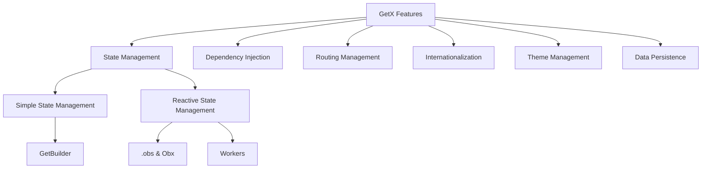
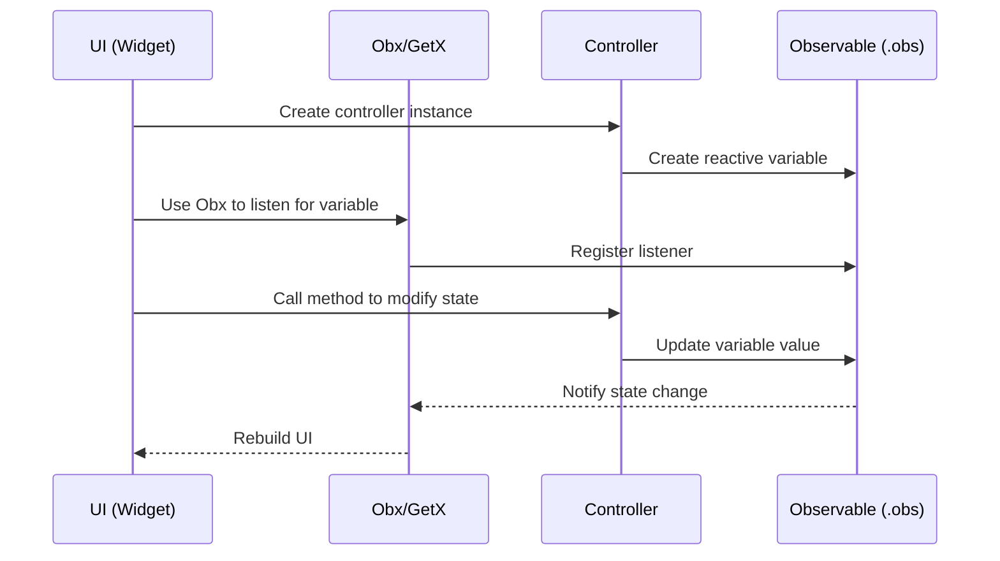

# getx_demo

A new Flutter project.

## Getting Started

This project is a starting point for a Flutter application.

A few resources to get you started if this is your first Flutter project:

- [Lab: Write your first Flutter app](https://docs.flutter.dev/get-started/codelab)
- [Cookbook: Useful Flutter samples](https://docs.flutter.dev/cookbook)

For help getting started with Flutter development, view the
[online documentation](https://docs.flutter.dev/), which offers tutorials,
samples, guidance on mobile development, and a full API reference.

## Project Structure

```
lib/
├── app/
│   ├── controllers/       # 控制器（状态管理）
│   ├── modules/           # 各功能模块的UI页面
│   ├── routes/            # 路由管理
│   ├── translations/      # 国际化翻译
│   └── bindings/          # 依赖注入绑定
└── main.dart              # 应用入口
```

## Features

This project showcases the six core features of GetX:



### 1. State Management

GetX provides two state management approaches: simple state management and reactive state management.

#### Simple State Management

```dart
// Controller definition - using GetBuilder to update UI
class CounterController extends GetxController {
  int counter = 0;
  
  void increment() {
    counter++;
    update(); // Notify listeners to update
  }
}

// Using in UI
GetBuilder<CounterController>(
  builder: (controller) {
    return Text('${controller.counter}');
  },
)
```

Features:
- Lightweight, less memory usage
- Suitable for states that don't change frequently
- Requires manual call of `update()` method to update UI

#### Reactive State Management

```dart
// Controller definition - using .obs to create reactive variables
class ReactiveCounterController extends GetxController {
  RxInt count = 0.obs;
  
  void increment() {
    count.value++;
  }
}

// Using in UI
Obx(() => Text('${controller.count.value}'))
```

Features:
- Automatically responds to changes without manual update calls
- Supports multiple Workers to listen for changes
- Can listen for single variable changes
- Suitable for frequently changing states

### 2. Dependency Injection

GetX provides simple dependency injection mechanism without complex setup:

```dart
// Register dependency
Get.put<ThemeController>(ThemeController());

// Lazy loading registration
Get.lazyPut<CounterController>(() => CounterController());

// Get controller instance
final controller = Get.find<CounterController>();
```

In this project, we use Bindings class to manage dependencies uniformly:

```dart
class HomeBinding extends Bindings {
  @override
  void dependencies() {
    Get.put<ThemeController>(ThemeController(), permanent: true);
    Get.lazyPut<CounterController>(() => CounterController(), fenix: true);
  }
}
```

### 3. Routing Management

GetX provides advanced routing management system without needing context for navigation:

```dart
// Define routes
GetPage(
  name: Routes.SIMPLE_COUNTER,
  page: () => SimpleCounterPage(),
  binding: SimpleCounterBinding(),
  transition: Transition.rightToLeft,
),

// Navigate to named route
Get.toNamed(Routes.SIMPLE_COUNTER);

// Return
Get.back();

// Show dialog
Get.dialog(AlertDialog(...));

// Show Snackbar
Get.snackbar('Title', 'Content');
```

### 4. Internationalization

GetX provides simple internationalization solution:

```dart
// Define translations
class AppTranslations extends Translations {
  @override
  Map<String, Map<String, String>> get keys => {
    'en_US': {
      'hello': 'Hello',
    },
    'zh_CN': {
      'hello': '你好',
    },
  };
}

// Use translations
Text('hello'.tr)

// Translated with parameters
Text('greeting'.trParams({'name': 'John'}))

// Switch language
Get.updateLocale(Locale('zh', 'CN'));
```

### 5. Theme Management

GetX provides convenient theme management functionality:

```dart
// Switch theme mode
Get.changeThemeMode(ThemeMode.dark);

// Apply custom theme
Get.changeTheme(ThemeData.dark());
```

### 6. Data Persistence

Combining GetStorage for simple data persistence:

```dart
// Initialize
await GetStorage.init();

// Store data
final box = GetStorage();
box.write('key', value);

// Read data
final value = box.read('key');
```

## GetX Working Flow

Below is the basic working flow of GetX reactive state management:



## Why Choose GetX?

GetX provides "Three Highs" for Flutter development:

1. **High Performance**: GetX focuses on performance and minimal resource consumption. It doesn't rely on Streams or ChangeNotifier.

2. **High Efficiency**: GetX provides clear and concise syntax. You can implement complex features with just a few lines of code.

3. **Clear Structure**: It can completely separate UI, presentation logic, business logic, and dependency injection, making the code more modular, easier to test, and maintainable.

## Project Features

- **Simple Counter**: Showcase Simple State Management using GetBuilder
- **Reactive Counter**: Showcase .obs and Obx Reactive State Management
- **Todo List**: Showcase Reactive State Management combined with Data Persistence
- **Theme Setting**: Showcase Dynamic Theme Switching and Persistence
- **Language Setting**: Showcase Multi-language Support and Real-time Switching

## Reference

- [GetX State Management Official Documentation](https://github.com/jonataslaw/getx/blob/master/documentation/zh_CN/state_management.md)
- [GetX pub.dev Page](https://pub.dev/packages/get)
