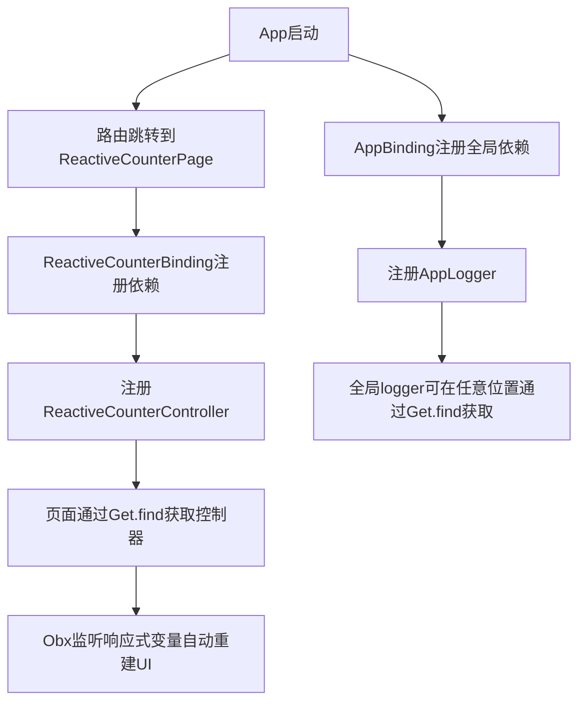

# GetX Demo

本项目是一个基于 Flutter + GetX 的多功能演示项目，涵盖了状态管理、依赖注入、路由管理、国际化、主题切换、数据持久化等常用场景。

## 功能注册与使用策略

以“响应式计数器”模块为例，说明全局依赖注册、控制器注入、页面使用的完整流程：



- **全局依赖注册**：在 `AppBinding` 中注册全局工具（如 logger），保证全局唯一。
- **模块依赖注册**：每个模块有独立的 Binding，负责注册本模块控制器。
- **依赖获取**：页面/控制器通过 `Get.find<类型>()` 获取依赖，无需手动传递。
- **响应式状态管理**：控制器中用 `.obs` 创建响应式变量，页面用 `Obx` 自动监听并重建UI。
- **全局日志**：logger 通过依赖注入全局唯一，所有日志输出统一管理。

---

## 主要特性
- **GetX 状态管理**：支持简单状态管理与响应式状态管理。
- **依赖注入**：利用 GetX 的依赖注入机制，所有控制器和全局工具（如 logger）均通过全局注册和获取，避免重复声明和内存泄漏。
- **全局日志管理**：
  - 使用 [logger](https://pub.dev/packages/logger) 插件统一日志输出。
  - 日志通过 `AppLogger` 封装，并在 `AppBinding` 中全局注册。
  - 任何地方可通过 `Get.find<AppLogger>()` 获取 logger 实例，调用 `logger.d()`、`logger.i()` 等方法输出日志。
  - 所有原有 `print` 已替换为 logger，日志更专业、可控。
- **国际化**：支持中英文切换，语言切换和持久化由 `LanguageController` 管理。
- **主题切换**：支持明暗主题，动态切换。
- **数据持久化**：集成 GetStorage。
- **模块化结构**：每个功能模块有独立的 binding、controller、page。

## 目录结构
```
lib/
  app/
    core/           # 全局工具（如 logger）
    controllers/    # 控制器
    modules/        # 各功能模块
    routes/         # 路由配置
    translations/   # 国际化
  main.dart         # 应用入口
```

## 全局日志用法
1. **获取 logger 实例**：
   ```dart
   final logger = Get.find<AppLogger>();
   logger.d('调试日志');
   logger.i('信息日志');
   logger.e('错误日志');
   ```
2. **无需手动初始化**，已在 `AppBinding` 中全局注册。
3. **所有日志输出已替换 print**，便于后期维护和扩展。

## 依赖安装
```shell
flutter pub get
```

## 运行项目
```shell
flutter run
```

## 其他说明
- 如需自定义日志格式、输出到文件等，可在 `lib/app/core/logger.dart` 中扩展。
- 项目借鉴 Jetpack 架构思想（如依赖注入、模块化、单一职责等），代码风格统一，易于维护

---

如有问题欢迎提 issue 或交流！
