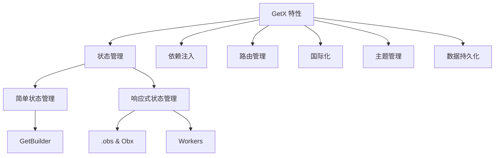
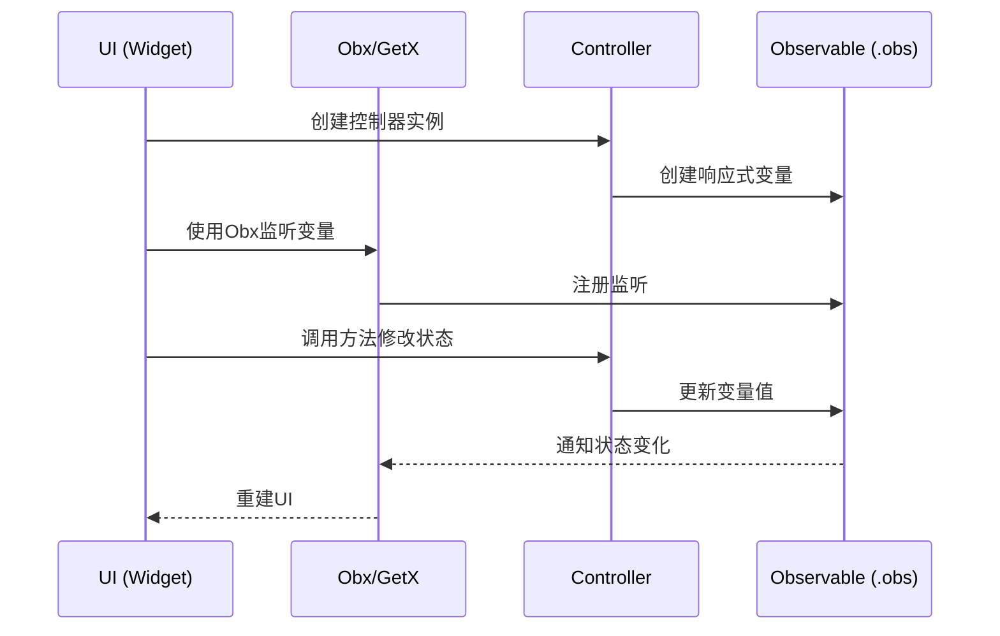

# GetX 演示应用

本项目是一个展示 GetX 状态管理和工具集框架各种功能的 Flutter 应用，帮助开发者学习和理解 GetX 的核心特性。

## 项目结构

```
lib/
├── app/
│   ├── controllers/       # 控制器（状态管理）
│   ├── modules/           # 各功能模块的UI页面
│   ├── routes/            # 路由管理
│   ├── translations/      # 国际化翻译
│   └── bindings/          # 依赖注入绑定
└── main.dart              # 应用入口
```

## 功能特性

本项目展示了 GetX 的六大核心功能：



### 1. 状态管理

GetX 提供了两种状态管理方式：简单状态管理和响应式状态管理。

#### 简单状态管理

```dart
// 控制器定义 - 使用GetBuilder更新UI
class CounterController extends GetxController {
  int counter = 0;
  
  void increment() {
    counter++;
    update(); // 通知监听者更新
  }
}

// 在UI中使用
GetBuilder<CounterController>(
  builder: (controller) {
    return Text('${controller.counter}');
  },
)
```

特点：
- 轻量级，更少的内存占用
- 适合不频繁变化的状态
- 需要手动调用 `update()` 方法更新UI

#### 响应式状态管理

```dart
// 控制器定义 - 使用.obs创建响应式变量
class ReactiveCounterController extends GetxController {
  RxInt count = 0.obs;
  
  void increment() {
    count.value++;
  }
}

// 在UI中使用
Obx(() => Text('${controller.count.value}'))
```

特点：
- 自动响应变化，无需手动调用update
- 支持多种Workers监听变化
- 可以监听单个变量变化
- 适合频繁变化的状态

### 2. 依赖注入

GetX提供了简单的依赖注入机制，无需复杂的设置：

```dart
// 注册依赖
Get.put<ThemeController>(ThemeController());

// 懒加载注册
Get.lazyPut<CounterController>(() => CounterController());

// 获取控制器实例
final controller = Get.find<CounterController>();
```

在本项目中，我们使用了Bindings类统一管理依赖：

```dart
class HomeBinding extends Bindings {
  @override
  void dependencies() {
    Get.put<ThemeController>(ThemeController(), permanent: true);
    Get.lazyPut<CounterController>(() => CounterController(), fenix: true);
  }
}
```

### 3. 路由管理

GetX提供了先进的路由管理系统，不需要context即可导航：

```dart
// 定义路由
GetPage(
  name: Routes.SIMPLE_COUNTER,
  page: () => SimpleCounterPage(),
  binding: SimpleCounterBinding(),
  transition: Transition.rightToLeft,
),

// 导航到命名路由
Get.toNamed(Routes.SIMPLE_COUNTER);

// 返回
Get.back();

// 显示对话框
Get.dialog(AlertDialog(...));

// 显示Snackbar
Get.snackbar('标题', '内容');
```

### 4. 国际化

GetX 提供了简单的国际化解决方案：

```dart
// 定义翻译
class AppTranslations extends Translations {
  @override
  Map<String, Map<String, String>> get keys => {
    'en_US': {
      'hello': 'Hello',
    },
    'zh_CN': {
      'hello': '你好',
    },
  };
}

// 使用翻译
Text('hello'.tr)

// 带参数的翻译
Text('greeting'.trParams({'name': 'John'}))

// 切换语言
Get.updateLocale(Locale('zh', 'CN'));
```

### 5. 主题管理

GetX 提供了便捷的主题管理功能：

```dart
// 切换主题模式
Get.changeThemeMode(ThemeMode.dark);

// 应用自定义主题
Get.changeTheme(ThemeData.dark());
```

### 6. 数据持久化

结合 GetStorage 实现简单的数据持久化：

```dart
// 初始化
await GetStorage.init();

// 存储数据
final box = GetStorage();
box.write('key', value);

// 读取数据
final value = box.read('key');
```

## GetX 工作流程

下面是 GetX 响应式状态管理的基本工作流程：



## 为什么选择 GetX?

GetX 提供了对 Flutter 开发的"三大高效"：

1. **高性能**: GetX 专注于性能和最小资源消耗。它不依赖于 Streams 或 ChangeNotifier。

2. **高效率**: GetX 提供了清晰而简洁的语法。您只需编写几行代码就能实现复杂功能。

3. **结构清晰**: 可以完全分离视图、表现逻辑、业务逻辑和依赖注入，使代码更加模块化、易于测试和维护。

## 项目特点

- **简单计数器**: 展示 GetBuilder 的简单状态管理
- **响应式计数器**: 展示 .obs 和 Obx 的响应式状态管理
- **Todo 列表**: 展示响应式状态管理结合数据持久化
- **主题设置**: 展示动态主题切换和持久化
- **语言设置**: 展示多语言支持和实时切换

## 参考资料

- [GetX 状态管理官方文档](https://github.com/jonataslaw/getx/blob/master/documentation/zh_CN/state_management.md)
- [GetX pub.dev 页面](https://pub.dev/packages/get)
