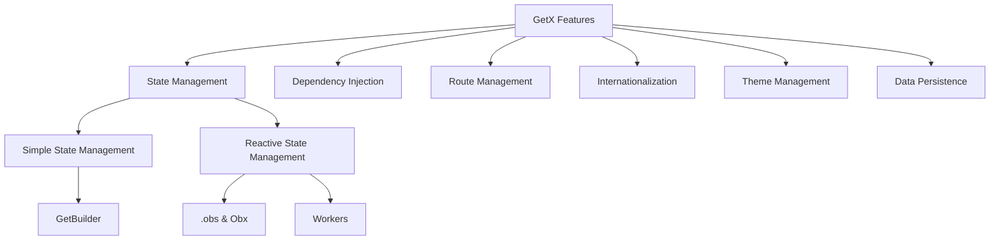

# GetX Demo

This project is a Flutter application showcasing the various features of the GetX state management and utility framework, helping developers learn and understand the core features of GetX.

## Project Structure

```
lib/
├── app/
│   ├── controllers/       # Controllers (state management)
│   ├── modules/           # UI pages for each feature module
│   ├── routes/            # Route management
│   ├── translations/      # Internationalization
│   └── bindings/          # Dependency injection bindings
└── main.dart              # Application entry point
```


## Features

This project demonstrates the six core features of GetX:



### 1. State Management

GetX provides two state management approaches: simple state management and reactive state management.

#### Simple State Management

```dart
// Controller definition - using GetBuilder to update UI
class CounterController extends GetxController {
  int counter = 0;
  
  void increment() {
    counter++;
    update(); // Notify listeners to update
  }
}

// Usage in UI
GetBuilder<CounterController>(
  builder: (controller) {
    return Text('${controller.counter}');
  },
)
```

Features:
- Lightweight with less memory usage
- Suitable for states that don't change frequently
- Requires manual call to `update()` method to refresh UI

#### Reactive State Management

```dart
// Controller definition - using .obs to create reactive variables
class ReactiveCounterController extends GetxController {
  RxInt count = 0.obs;
  
  void increment() {
    count.value++;
  }
}

// Usage in UI
Obx(() => Text('${controller.count.value}'))
```

Features:
- Automatically responds to changes without manual update calls
- Supports various Workers to monitor changes
- Can monitor changes to individual variables
- Suitable for frequently changing states

### 2. Dependency Injection

GetX provides a simple dependency injection mechanism without complex setup:

```dart
// Register dependency
Get.put<ThemeController>(ThemeController());

// Lazy loading registration
Get.lazyPut<CounterController>(() => CounterController());

// Get controller instance
final controller = Get.find<CounterController>();
```

In this project, we use Bindings classes to manage dependencies:

```dart
class HomeBinding extends Bindings {
  @override
  void dependencies() {
    Get.put<ThemeController>(ThemeController(), permanent: true);
    Get.lazyPut<CounterController>(() => CounterController(), fenix: true);
  }
}
```

### 3. Route Management

GetX provides an advanced routing system that doesn't require context for navigation:

```dart
// Define route
GetPage(
  name: Routes.SIMPLE_COUNTER,
  page: () => SimpleCounterPage(),
  binding: SimpleCounterBinding(),
  transition: Transition.rightToLeft,
),

// Navigate to named route
Get.toNamed(Routes.SIMPLE_COUNTER);

// Go back
Get.back();

// Show dialog
Get.dialog(AlertDialog(...));

// Show Snackbar
Get.snackbar('Title', 'Message');
```

### 4. Internationalization

GetX provides a simple internationalization solution:

```dart
// Define translations
class AppTranslations extends Translations {
  @override
  Map<String, Map<String, String>> get keys => {
    'en_US': {
      'hello': 'Hello',
    },
    'zh_CN': {
      'hello': '你好',
    },
  };
}

// Use translation
Text('hello'.tr)

// Translation with parameters
Text('greeting'.trParams({'name': 'John'}))

// Switch language
Get.updateLocale(Locale('zh', 'CN'));
```

### 5. Theme Management

GetX provides convenient theme management features:

```dart
// Switch theme mode
Get.changeThemeMode(ThemeMode.dark);

// Apply custom theme
Get.changeTheme(ThemeData.dark());
```

### 6. Data Persistence

Implement simple data persistence with GetStorage:

```dart
// Initialize
await GetStorage.init();

// Store data
final box = GetStorage();
box.write('key', value);

// Read data
final value = box.read('key');
```

## Global Logger Usage
1. **Get logger instance**:
   ```dart
   final logger = Get.find<AppLogger>();
   logger.d('Debug log');
   logger.i('Info log');
   logger.e('Error log');
   ```
2. **No manual initialization needed**, already globally registered in `AppBinding`.
3. **All log outputs have replaced print**, making maintenance and extension easier.

## Dependencies Installation
```shell
flutter pub get
```

## Running the Project
```shell
flutter run
```

## Additional Notes
- To customize log formats, output to files, etc., you can extend functionality in `lib/app/core/logger.dart`.
- The project draws inspiration from Jetpack architecture principles (such as dependency injection, modularization, single responsibility), with unified code style for easy maintenance.

---

If you have any questions, feel free to open an issue or reach out!
